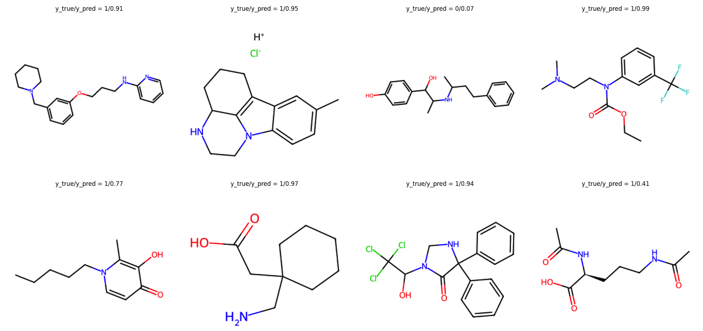
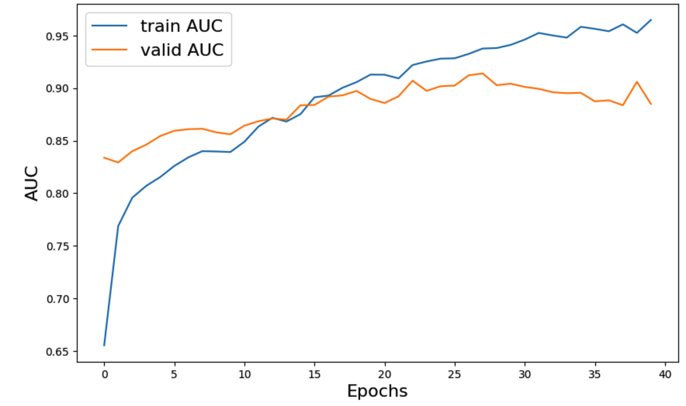

# Blood Brain Barrier Permeability (BBBP) Prediction Using MPNN

## Introduction:

In this model, we're diving into the fascinating world of graph neural networks (GNNs), with a spotlight on a variant known as the Message Passing Neural Network (MPNN). Our journey will focus on harnessing the power of MPNNs to predict a critical molecular attribute: blood-brain barrier permeability (BBBP).



Why MPNNs, you ask? Well, molecules naturally embody the structure of undirected graphs, G = (V, E), where V represents vertices (or nodes, akin to atoms) and E symbolizes edges (or bonds). This inherent graphical nature makes GNNs, especially MPNNs, an enticing choice for predicting molecular properties.

Traditionally, the prediction of molecular properties has leaned heavily on methods like random forests and support vector machines. These conventional techniques rely on precomputed molecular descriptors — think molecular weight, polarity, or the number of carbon atoms. While these descriptors have served us well, paving the way for numerous discoveries, there's a growing belief that diving deeper into the "raw", "low-level" features of molecules could unveil even more profound insights.

Thus, through this model, we're not just implementing an MPNN. We're embarking on a quest to see if a more nuanced understanding of molecules, through the lens of graph theory and neural networks, can provide us with a richer, more accurate predictive capability.

## Installation:

The dependencies should be installed before the training. The repository can be downloaded from GitHub.

`git clone https://github.com/nidhinthomas-ai/BBBP_MPNN.git`  

The custom conda environement required for this workflow can be installed through `conda`.  

`conda env create -f environment.yml`  

In order to activate the environment:  

`conda activate mpnn_env`  

## Code Layout:

The repository is meticulously structured to facilitate the development and execution of a Message Passing Neural Network (MPNN) aimed at predicting molecular properties, specifically focusing on blood-brain barrier permeability (BBBP). Here's a concise overview of the repository's structure:

Features executable scripts for training (**train.p**y) and inference (**inference.py**) are maintained in the home directory.   
The training script manages the model's learning process, including optimization and validation, while the inference script demonstrates how to use the trained model for predicting molecular properties on new data.  

**bbbp_mpnn:** Serves as the core module, housing essential components like utility functions (**utils.py**), dataset handling (**dataset.py**), neural network model architecture (**model.py**), and specific MPNN implementations (**mpnn.py**).  

**data:** Contains **BBBP.CSV** files with the dataset for training, validation, and testing, including molecular representations and corresponding properties.  

**model:** The directory contains the trained model weights that user can directly import for ineference. 

**notebook:** It contains the colab notebook used for training and inference. This notebook also saves the AUC curves and inference structures and predictions. 

## Train:

In order to train the model for BBBP, use the following command:

```
python train.py --dataset data/BBBP.csv
```



## Inference:

We can validate how the model performs for unseen data using **inference.py** file. Use the following command:

```
python inference.py --dataset ./data/BBBP.csv --model_path ./model/mpnn_best_model.h5  --output_path ./bbbp_mpnn_pred
```

## Trained model:

This repository contains the trained model weights in the model directory. You can also use the model directly for inference. 